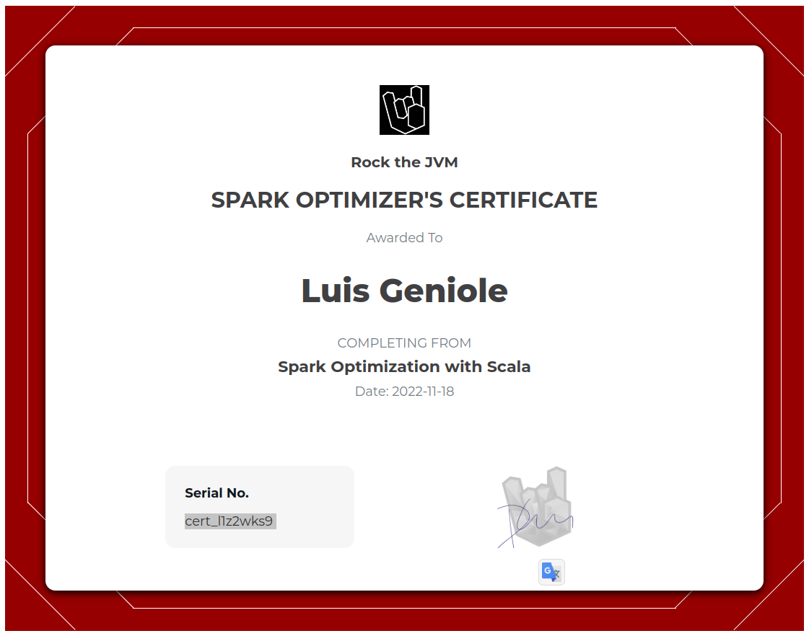

# Rock The JVM - Spark Optimizations with Scala

Master Spark optimization techniques with Scala.

- https://rockthejvm.com/p/spark-optimization
- https://github.com/rockthejvm/spark-optimization
- https://github.com/rockthejvm/spark-optimization/releases/tag/start

## Certificate



## Sections

1. [Scala and Spark Recap](src/main/scala/section1)
2. [Spark Performance Foundations](src/main/scala/section2)
3. [Optimizing DataFrame Transformations](src/main/scala/section3)
4. [Optimizing RDD Transformations](src/main/scala/section4)
5. [Optimizing Key-Value RDDs](src/main/scala/section5)

## Setup

### IntelliJ IDEA

Install IntelliJ IDEA with the Scala plugin.

- https://www.jetbrains.com/idea/

### Docker

Install Docker:

- https://docs.docker.com/desktop/install/ubuntu/
- https://docs.docker.com/engine/install/ubuntu/#set-up-the-repository

Start all required containers:

```bash
$ docker compose up
```

Access each container:

```bash
# List active containers
$ docker ps
# Get a shell in any container
$ docker exec -it CONTAINER_NAME bash
```

To reset docker container state, purge them with:

```bash
$ ./docker-clean.sh
```
